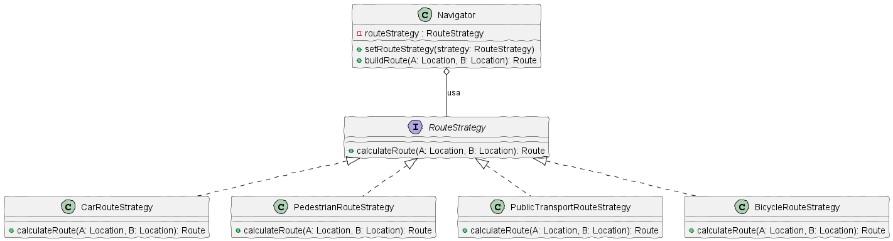

# Aplicación de Diferentes Transportes 🗺️📍

## Integrantes 👷:
* Juan Estaban Cañón Solorza
* David Felipe Gil Laverde
* Juan Sebastian Diaz Peña

## UML 🌉:

## 🌟 Resumen del Proyecto
Una aplicación de navegación para viajeros ocasionales. La aplicación ayudaba a los usuarios a orientarse rápidamente en cualquier ciudad. Una de las funciones más solicitadas para la aplicación era la planificación automática de rutas. Un usuario debía poder introducir una dirección y ver la ruta más rápida a ese destino mostrado en el mapa. La primera versión de la aplicación sólo podía generar las rutas sobre carreteras. En la siguiente actualización, añadiste una opción para crear rutas a pie. Después, añadiste otra opción para permitir a las personas utilizar el transporte público en sus rutas. Sin embargo, esto era sólo el principio. Más tarde planeaste añadir la generación de rutas para ciclistas, y más tarde, otra opción para trazar rutas por todas las atracciones turísticas de una ciudad.

Cada vez que añadías un nuevo algoritmo de enrutamiento, la clase principal del navegador doblaba su tamaño. En cierto momento, se volvió demasiado difícil de mantener. Cualquier cambio en alguno de los algoritmos, ya fuera un sencillo arreglo de un error o un ligero ajuste de la representación de la calle, afectaba a toda la clase, aumentando las probabilidades de crear un error en un código ya funcional. Además, el trabajo en equipo se volvió ineficiente. Tus compañeros, contratados tras el exitoso lanzamiento, se quejaban de que dedicaban demasiado tiempo a resolver conflictos de integración. Implementar una nueva función te exige cambiar la misma clase enorme, entrando en conflicto con el código producido por otras personas.

## 🛠️ Solución de Diseño: Patrón Método Strategy
La solución al problema de la duplicación de código (manteniendo la estructura del algoritmo) se logra mediante el uso del Patrón de Diseño de Comportamiento: Método Strategy